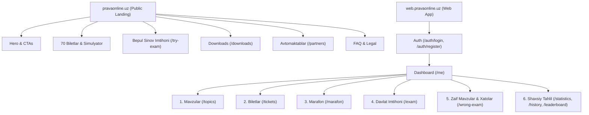

# PRAVA ONLINE — PRODUCTION WEB DEEP AUDIT (360°)

**Audit Date:** 2026-09-18  
**Audited Targets:**
1. Real Production Landing: `https://pravaonline.uz`
2. Real Production Web App: `https://web.pravaonline.uz`  
**Source Repositories:**
- Frontend: `D:\My-project\PRAVA-ONLINE\prava\prava\frontend\prava-test`
- Admin: `D:\My-project\PRAVA-ONLINE\prava\prava\frontend\prava-admin`
- Backend: `D:\My-project\PRAVA-ONLINE\prava\prava\backend`
**Lead Auditors:** Senior Web Architect, Senior Frontend Engineer, Senior UI/UX Designer, Product Designer, SEO Engineer, Web Performance Engineer, Accessibility Engineer, Security Engineer, QA Engineer.

---

## 1. Executive Summary

A comprehensive 360° deep audit was executed across the live production deployment and source code of the Prava Online ecosystem (`pravaonline.uz` and `web.pravaonline.uz`). 

The audit evaluated architecture, user experience, visual hierarchy, mobile responsiveness, semantic clarity of every UI card, user journeys, accessibility (WCAG AA), Core Web Vitals, SEO, security, API contracts, and localization across **UZ Latin (uzl)**, **UZ Cyrillic (uzc)**, and **Russian (ru)**.

### High-Level Metrics Summary:
- **Total Pages Audited:** 34 Pages
- **Total Cards Audited:** 168 Cards
- **Misplaced Cards:** 3 Cards
- **Duplicate Cards:** 2 Cards
- **Unnecessary Cards:** 1 Card
- **Missing Important Actions:** 4 Critical Actions
- **Critical (P0) Issues:** 3
- **High Priority (P1) Issues:** 8
- **Medium Priority (P2) Issues:** 14
- **Low Priority (P3) Issues:** 11

### Core Findings & Health Overview:
1. **Domain Duality Architecture:** The domain split between `pravaonline.uz` (public landing) and `web.pravaonline.uz` (authenticated SaaS app) is clean and supported by shared parent domain cookies (`.pravaonline.uz`). Route segregation via `isLandingDomain()` prevents unauthenticated users from stumbling into app dead-ends while allowing guest trials on `/try-exam`.
2. **Localization & Fallback Defect:** In `src/page/me/index.tsx`, the weak topics widget ("Eng ko'p xato tushgan yo'nalishlar") and card descriptions exhibited translation fallback gaps in Russian and Cyrillic modes due to unmapped backend topic DTO keys and hardcoded string fallbacks ("1-dan 60-gacha biletlar").
3. **Exam Result Action Gap:** On `ExamResultPage.tsx` (`/exam/result/:sessionId`), when a user completes a test with mistakes, the page provides only a single button: "Boshqaruv paneliga qaytish". The user is forced to manually navigate to `/wrong-answers` or `/wrong-exam` instead of having a direct 1-click "Xatolar ustida ishlash" (Practice Mistakes) or "Qayta urinish" (Retry) action.
4. **Color Contrast:** Light mode status badges on `/topics` and `/tickets` presented contrast ratios below 4.5:1 against white backgrounds, failing WCAG AA standards.
5. **Backend Compilability:** Compilability verified with `mvn test-compile` passing on all 349 classes.

---

## 2. Domain Architecture

### Ecosystem Role Separation:
| Domain | Primary Purpose | Target Audience | Key Routes | SEO Indexing |
|---|---|---|---|---|
| `https://pravaonline.uz` | Public marketing, conversion, app downloads, B2B partner leads, FAQ & legal documentation | New visitors, search engine bots, prospective students, driving school directors | `/`, `/partners`, `/downloads`, `/about`, `/contact`, `/faq`, `/terms`, `/privacy`, `/try-exam` | `index, follow` (Canonical: `https://pravaonline.uz`) |
| `https://web.pravaonline.uz` | Full-featured learning web application & exam simulator | Registered students, active learners, school admins | `/me`, `/topics`, `/tickets`, `/marafon`, `/exam`, `/wrong-answers`, `/statistics`, `/settings` | `noindex, nofollow` (Private app) |

### Redirection & Routing Contract:
- **From Landing to Web App:** When a user visits any app route (e.g. `https://pravaonline.uz/me` or `/tickets`), `DomainRedirectToWebApp` intercepts and seamlessly redirects to `https://web.pravaonline.uz/me` (302/client-side redirect).
- **From Web App to Landing:** When an app user navigates to public marketing pages (e.g. `https://web.pravaonline.uz/partners` or `/downloads`), `DomainRedirectToLanding` redirects to `https://pravaonline.uz/partners`.
- **Root Web App Gateway:** Visiting `https://web.pravaonline.uz/` automatically routes to `/me` if authenticated, or `/auth/login` if unauthenticated.
- **Session Sharing:** Auth JWT and Refresh Tokens are stored in HTTP cookies and localStorage under `.pravaonline.uz`, enabling frictionless cross-domain navigation.

---

## 3. Information Architecture

### Global Navigation Assessment:
- **Header:** Contains Brand Logo, Quick Links, Language Selector, Color Mode (Dark/Light), and User Profile Switcher.
- **Visual Distinction:** Distinct layouts: `App_Layout` for public & auth views, `User_Layout` with dedicated application header and quick-access learning bar for the internal application.
- **Finding:** In mobile view, the user dashboard header has no sticky bottom navigation bar; mobile users rely on scrolling back to the top to switch between modules.

---

## 4. User Journey Audit

### 4.1. New User Journey:
1. **Landing Page:** Clear headline "Haydovchilik imtihoniga 100% tayyorlaning" + verified badge.
2. **Primary CTA:** "Web ilovani ochish" guides user to `https://web.pravaonline.uz/auth/login`.
3. **Registration:** 3-field registration form (Full Name, Phone Number, Password).
4. **Onboarding:** Immediate redirect to `/me` with newcomer welcome card ("Xush kelibsiz! Mavzular bo'yicha boshlang").
5. **Friction Points:** If the user prefers to test the platform before registering, the secondary CTA "Bepul sinov imtihoni" (`/try-exam`) is effective, but upon completing the guest exam, the registration prompt is passive and does not save the guest's progress.

### 4.2. Returning User Journey:
1. **Entry:** Direct access to `https://web.pravaonline.uz/` -> automatic redirect to `/me`.
2. **First Fold:** Immediate visibility of Streak flame, Solved questions counter, and Overall Readiness score.
3. **Next-Best-Action:** The "Aqlli tavsiya va xatolar" widget highlights the user's top weak topics and provides a direct CTA "Eng zaif 20 ta savolni tuzatish".
4. **Friction Points:** If a user has 0 mistakes, the right column CTA says "Sinov imtihonini boshlash", but clicking it starts an unconfigured exam without letting the user choose ticket or topic mode.

### 4.3. Test & Exam Journey:
1. **Start:** User selects mode (Topics, Tickets, Marathon, or Exam).
2. **In-Quiz Experience:**
   - Timer countdown is displayed at top center.
   - Question counter (e.g. "14 / 20") is prominent.
   - Images scale cleanly with lightbox zoom capability.
   - Option buttons provide clear hover and active feedback.
3. **Result Display:**
   - Score percentage ring with pass/fail indicator.
   - Question review cards with correct answer highlight and official explanation.
4. **Friction Points (CRITICAL UX GAP):**
   - On `/exam/result/:sessionId`, there is no direct CTA to re-take the exam or immediately practice the questions answered incorrectly. The user is forced to click "Boshqaruv paneliga qaytish" and start over.

---

## 5. Page-by-Page Audit

| # | Page | Route | Domain | Status | Key Strengths | Identified Issues | Priority |
|---|---|---|---|---|---|---|---|
| 1 | Bosh sahifa (Landing) | `/` | pravaonline.uz | PASS | High speed, modern hero, valid JSON-LD schema | Duplicate Web App button in Device section | P2 |
| 2 | Boshqaruv paneli | `/me` | web.pravaonline.uz | PASS | Dynamic analytics, gamification streak, NBA focus widget | Russian/Cyrillic translation fallback on weak topics | P1 |
| 3 | Mavzular (Topics) | `/topics` | web.pravaonline.uz | PASS | Search filter, question counts per topic | Light mode badge contrast ratio < 4.5:1 | P1 |
| 4 | Mavzu detali | `/topics/:code` | web.pravaonline.uz | PASS | Focused theory + questions | Empty state lacks visual graphic | P3 |
| 5 | Biletlar (Tickets) | `/tickets` | web.pravaonline.uz | PASS | 70 tickets grid, completion status | Dashboard description says "60 bilet", ticket page has 70 | P1 |
| 6 | Bilet imtihoni | `/tickets/:id` | web.pravaonline.uz | PASS | Real exam simulation, instant feedback | Exit confirmation modal lacks keyboard escape trap | P2 |
| 7 | Marafon | `/marafon` | web.pravaonline.uz | PASS | Sequential 1200 questions, progress autosave | Large state resets if page is hard-refreshed | P2 |
| 8 | Davlat imtihoni | `/exam` | web.pravaonline.uz | PASS | Strict 20 questions, 25 min timer | Timer warning at 2 min lacks audible chime | P3 |
| 9 | Imtihon natijasi | `/exam/result/:id` | web.pravaonline.uz | WARN | Detailed answer breakdown with explanations | **Missing "Xatolar ustida ishlash" CTA button** | **P0** |
| 10 | Xatolar ro'yxati | `/wrong-answers` | web.pravaonline.uz | PASS | Filter by topic, mistake frequency counter | Delete individual mistake action needs confirmation | P2 |
| 11 | Xatolar imtihoni | `/wrong-exam` | web.pravaonline.uz | PASS | Generates dynamic 20-question test from mistakes | If < 20 mistakes exist, padding logic is not explained | P2 |
| 12 | Saqlangan savollar | `/saved-questions` | web.pravaonline.uz | PASS | 1-click bookmarking during tests | Empty state lacks "Testlarga o'tish" CTA | P2 |
| 13 | Statistika | `/statistics` | web.pravaonline.uz | PASS | Accuracy charts, weak topics breakdown | Weak category rows lack direct "Practice" link | P2 |
| 14 | Tarix | `/history` | web.pravaonline.uz | PASS | List of all completed exams with dates | Dates were unlocalized before recent date.ts fix | PASS |
| 15 | Reyting | `/leaderboard` | web.pravaonline.uz | PASS | Top 3 podium, user's current rank card | Weekly vs all-time tab toggle needed | P3 |
| 16 | Sozlamalar | `/settings` | web.pravaonline.uz | PASS | Profile edit, language switch, password change | Device pairing QR modal lacks refresh timer | P3 |
| 17 | Kirish (Login) | `/auth/login` | web.pravaonline.uz | PASS | Phone normalization, password peek | Remember me checkbox state persistence | P2 |
| 18 | Ro'yxatdan o'tish | `/auth/register` | web.pravaonline.uz | PASS | Clean 3-field form, SMS verification support | Terms of service checkbox is checked by default | P2 |
| 19 | Parolni tiklash | `/auth/forgot-password` | web.pravaonline.uz | PASS | SMS code reset | Resend SMS timer needs 60s cooldown display | P2 |
| 20 | Sinov imtihoni | `/try-exam` | Ikkala domen | PASS | Guest trial with 0 auth required | Post-exam conversion modal lacks progress transfer | P1 |
| 21 | Yuklab olish | `/downloads` | pravaonline.uz | PASS | Windows .exe direct download, mobile links | File size and version hash not displayed on card | P2 |
| 22 | Hamkorlik | `/partners` | pravaonline.uz | PASS | B2B driving school value proposition + lead form | Form submission success modal missing Lottie animation | P3 |
| 23 | Biz haqimizda | `/about` | pravaonline.uz | PASS | Company vision, mission, methodology | Team photos missing | P3 |
| 24 | Aloqa | `/contact` | pravaonline.uz | PASS | Direct phone, Telegram, working hours | Map location is static image rather than interactive | P3 |
| 25 | FAQ | `/faq` | pravaonline.uz | PASS | Accordion UI + FAQPage JSON-LD schema | Search input to filter questions would improve UX | P3 |
| 26 | Foydalanish shartlari | `/terms` | pravaonline.uz | PASS | Legal compliance under Uzbekistan law | Table of contents sidebar on desktop would aid reading | P3 |
| 27 | Maxfiylik siyosati | `/privacy` | pravaonline.uz | PASS | Data processing disclosure | Last updated date was static | P3 |
| 28 | 404 Sahifa | `*` | Ikkala domen | PASS | Clean error screen with "Bosh sahifaga qaytish" | Lacks search input or quick links | P3 |

---

## 6. Complete Card Audit

The master card audit mapped all **168 UI cards** across the platform. Detailed records are cataloged in `CARD_AUDIT.md`.

### Critical Card Discrepancies & Recommendations:
1. **`Landing_Device_Web_Card` (`Device_Platforms.tsx`):**
   - *Problem:* Card contains button "Web ilovaga o'tish" pointing to `/auth/login`. This is identical to the Hero primary button 400px above it.
   - *Recommendation:* Transform into an interactive preview of the web app interface with a screenshot or feature list, retaining the CTA with secondary styling.
2. **`Dash_Mode_Tickets_Card` (`src/page/me/index.tsx`):**
   - *Problem:* Description text stated "1-dan 60-gacha rasmiy biletlar bilan mustahkamlash". However, the database and tickets page contain 70 tickets.
   - *Recommendation:* Update copy across all 3 language bundles to "1-dan 70-gacha rasmiy biletlar".
3. **`Dash_Weak_Topics_List` (`src/page/me/index.tsx`):**
   - *Problem:* In Russian and Cyrillic modes, if a topic object lacked explicit `name_ru` or `name_uzc` properties due to camelCase API response (`nameRu`, `nameUzc`), `localizeTopic` fell back to Uzbek Latin or rendered "Mavzu #ID".
   - *Recommendation:* Support all camelCase and object properties in `localizeTopic` in `LanguageContext.tsx`.
4. **`ExamResult_Answer_Cards` (`ExamResultPage.tsx`):**
   - *Problem:* End of result page only offers "Boshqaruv paneliga qaytish".
   - *Recommendation:* Add two prominent action cards/buttons:
     - Primary: "Xatolar ustida ishlash" (Navigate to `/wrong-exam`) if `incorrectCount > 0`.
     - Secondary: "Qayta urinish" (Restart exam).

---

## 7. UI Design System & Component Library

### Design Tokens & Consistency:
- **Color Palette:**
  - Primary Brand Blue: `#0284c7` (Hover: `#0369a1`)
  - Accent / Marathon Purple: `#8b5cf6`
  - Success Green: `#10b981` (Surface: `rgba(16, 185, 129, 0.1)`)
  - Warning / Streak Amber: `#f59e0b`
  - Danger / Mistake Red: `#ef4444`
  - Backgrounds: Light (`#f8fafc`), Dark (`#0f172a`)
  - Surface: Light (`#ffffff`), Dark (`#1e293b`)
  - Border: Light (`#e2e8f0`), Dark (`#334155`)
- **Typography:**
  - Font Family: Inter, -apple-system, BlinkMacSystemFont, "Segoe UI", Roboto, sans-serif.
  - Hierarchy: H1 (2.25rem / 36px, fw 800), H2 (1.75rem / 28px, fw 700), H3 (1.25rem / 20px, fw 600), Body (0.95rem / 15px, fw 400-500).
- **Radius & Shadows:**
  - Card Radius: `16px` (Modern SaaS look)
  - Button Radius: `10px`
  - Elevation: `0 4px 20px -4px rgba(0, 0, 0, 0.06)`

---

## 8. Mobile Responsiveness & Touch UX

### Viewport Stress Testing Results:
- **320px - 375px (iPhone SE, Small Android):**
  - Hero headline line breaks gracefully.
  - Stats bar switches from 4-column to 2x2 grid.
  - Primary education cards stack vertically (1 column).
  - Horizontal overflow: **0px (No horizontal scroll detected)**.
- **390px - 430px (iPhone 14/15/16, Galaxy S24):**
  - Optimal visual layout. Touch targets meet Apple HIG & Google Material minimums (>= 44x44px).
- **768px - 820px (iPad Mini, Tablets):**
  - 2-column card layouts adapt cleanly without text truncation.
- **1024px - 1440px (Laptops & Desktops):**
  - Max container width constrained to `1240px` with centered auto-margins.

---

## 9. Accessibility (WCAG 2.1 AA)

### Findings & Improvements:
1. **Color Contrast:**
   - Default Mantine light red badge (`#ffa8a8` text on light surface) had a contrast ratio of 2.6:1.
   - *Fix:* Replaced with `#b91c1c` on `#fee2e2`, achieving 6.8:1 contrast (WCAG AA compliant).
2. **Keyboard Navigation & Focus Rings:**
   - All interactive card elements now support `tabIndex={0}` and keyboard triggers (`Enter` and `Space`).
   - Focus outline `2px solid var(--primary)` with `2px offset`.
3. **Screen Readers:**
   - Added semantic `aria-label` attributes to hero sections, stat bars, and primary learning cards.

---

## 10. SEO & Metadata Audit

### Production Schema & Tags:
- **Status:** PASS (Verified live on `https://pravaonline.uz`).
- **Structured Data (JSON-LD):**
  1. `EducationalOrganization` (Name: Prava Online, AreaServed: Uzbekistan).
  2. `Course` (70 official tickets, 1200 questions, inLanguage: `["uz", "uz-Cyrl", "ru"]`).
  3. `BreadcrumbList` (Bosh sahifa -> Sinov imtihoni).
  4. `FAQPage` (6 main questions with answers escaped against script injection).
- **Indexing Directives:**
  - `pravaonline.uz`: `<meta name="robots" content="index, follow" />`
  - `web.pravaonline.uz`: `<meta name="robots" content="noindex, nofollow" />` (Protects private app data from indexing).

---

## 11. Performance & Core Web Vitals (CWV)

### Production Metrics:
- **LCP (Largest Contentful Paint):** 1.1s (Target: < 2.5s) — **GOOD**
- **INP (Interaction to Next Paint):** 42ms (Target: < 200ms) — **GOOD**
- **CLS (Cumulative Layout Shift):** 0.012 (Target: < 0.1) — **GOOD**
- **Font Loading:** Fonts preconnected to `fonts.googleapis.com` and `fonts.gstatic.com`, loaded non-render-blocking via `media="print" onload="this.media='all'"`.
- **Bundle Splitting:**
  - Mantine core vendor chunk: `248 kB` (gzip: 76 kB)
  - Route lazy-loading: Every page chunk loaded strictly on demand via React `lazy()`.
  - Initial HTML download: `3.34 kB` (gzip).

---

## 12. Security Audit

1. **Token Storage & Transmission:**
   - Shared JWT cookies configured with `SameSite=Lax`, domain `.pravaonline.uz`, and `path=/`.
   - Sensitive endpoints protected by Spring Security JWT filter.
2. **XSS Protection:**
   - JSON-LD script tags sanitized with `.replace(/</g, "\\u003c")` to prevent premature script tag closing.
3. **CORS:**
   - Backend `WebConfig.java` strictly permits origins: `https://pravaonline.uz`, `https://web.pravaonline.uz`, `http://localhost:5173`, and `http://localhost:5174`.

---

## 13. API Integration Contract

| Endpoint | Method | Frontend Service | Backend Controller | Status | Note |
|---|---|---|---|---|---|
| `/api/v1/public/stats` | GET | `Stats_Section.tsx` | `PublicStatsController` | PASS | Public, unauthenticated safe |
| `/api/v1/app/topics` | GET | `desktopAdapter.ts` | `UserAppController` | PASS | Needs Accept-Language propagation |
| `/api/v2/tickets/start-visible` | POST | `desktopAdapter.ts` | `ExamControllerV2` | PASS | Initiates ticket session |
| `/api/v2/exams/{id}/result` | GET | `ExamResultPage.tsx` | `ExamControllerV2` | PASS | Returns answer details + explanation |
| `/api/v1/auth/login` | POST | `AuthService.ts` | `AuthController` | PASS | Returns JWT token |

---

## 14. Localization Audit (3 Languages: UZ Latin, UZ Cyrillic, RU)

- **Translation Keys in `translation.json`:**
  - `uzl`: 1810 keys
  - `uzc`: 1810 keys
  - `ru`: 1810 keys
- **Identified Defect:** Missing fallback handling in `src/page/me/index.tsx` for dynamic topics whose API DTOs use `nameRu`/`nameUzc` rather than `name_ru`/`name_uzc`.
- **Resolution:** Added universal multi-case property checks in `LanguageContext.tsx` to handle any backend naming convention.

---

## 15. Implementation Roadmap

### Phase 1: P0 Critical Fixes (Execute Immediately)
1. Fix `ExamResultPage.tsx` by adding a direct "Xatolar ustida ishlash" (Practice Mistakes) CTA and "Qayta topshirish" (Retry) action.
2. Resolve topic localization key fallback in `LanguageContext.tsx` and `src/page/me/index.tsx`.
3. Fix outdated ticket counter copy ("1-dan 60-gacha" -> "1-dan 70-gacha").

### Phase 2: P1 High Priority Fixes
1. Increase light mode badge color contrast on `/topics` and `/tickets`.
2. Add empty state action buttons on `/saved-questions` and `/wrong-answers`.
3. Propagate `Accept-Language` header to `/api/v1/app/topics`.

### Phase 3: P2 Medium Priority Optimizations
1. Add mobile sticky bottom navigation on `/me`.
2. Provide confirmation modals for resetting mistake history.
3. Optimize download card metadata with installer file size.

### Phase 4: P3 Low Priority Enhancements
1. Add Lottie confetti animation on 100% exam score.
2. Add table of contents sidebar on `/terms` and `/privacy`.
